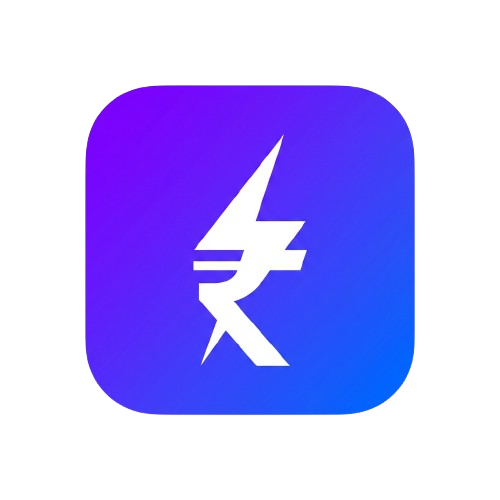

<p align="center">
  
</p>

<h1 align="center">Bylit</h1>

<p align="center">
  <strong>A fast, offline-first personal finance manager for Android & iOS</strong>
</p>

<p align="center">
  
  
  
  
  
  
</p>

---

## Overview

**Bylit** (Byte + Lit) is a blazing-fast, **100% offline** personal finance app built with React Native and Expo. It gives you complete control over your money — track expenses, manage multiple accounts, split bills with friends, monitor subscriptions, set budgets, and view rich analytics — all stored locally on your device with zero cloud dependency.

---

## ✨ Features

### 💸 Transactions
- Log **income**, **expenses**, **transfers**, **lends**, and **borrows**
- Running balance calculation per account with historical accuracy
- Assign categories, descriptions, and due dates
- Settle lend/borrow records with automatic linked transactions

### 🏦 Accounts
- Manage multiple accounts (Bank, Cash, Wallet, etc.)
- Real-time balance updates on every transaction
- Transfer funds between accounts

### 🏷️ Categories
- Create custom income/expense categories with icons and colors
- Category-wise transaction drill-down from Analytics and Categories screens

### 📊 Analytics
- Monthly and yearly spending breakdown with bar charts
- Category-wise expense distribution
- Income vs. expense comparison views

### 💰 Budgets
- Set per-category monthly spending limits
- Visual budget progress tracking

### 🔀 Split Bills
- Split expenses **equally**, by **parts**, or by **percentage**
- Auto-creates lend transactions for each participant
- Modern settlement UI — pick receiving account when marking paid
- Contacts integration for quick participant lookup

### 🔁 Subscriptions & Recurring Bills
- Track recurring income and expenses (hourly → yearly)
- Smart reminders ahead of due dates
- Auto-processes due transactions and updates next due dates
- Supports estimated amounts

### 🔔 Notifications
- Daily spending reminders at a configurable time
- Bill and loan due date alerts
- Scheduled exact alarms for time-sensitive reminders

### 💾 Backup & Restore
- Full **JSON backup** of all data (all tables)
- **CSV export** of transactions for spreadsheet analysis
- Monthly summary CSV export
- Import/restore from backup file

### 🎨 Customization
- **System theme** support — automatic dark/light mode
- Configurable font size and icon size
- Base currency selection (defaults to INR)

---

## 🛠️ Tech Stack

| Layer | Technology |
|---|---|
| Framework | [Expo](https://expo.dev) ~55 / React Native 0.83 |
| Language | TypeScript 5.9 |
| Navigation | Expo Router (file-based) |
| Local Database | `expo-sqlite` (SQLite with WAL mode) |
| State / Cache | TanStack React Query v5 |
| Charts | `react-native-gifted-charts` |
| Animations | React Native Reanimated 4 |
| Icons | `@expo/vector-icons`, `lucide-react-native` |
| Notifications | `expo-notifications` |
| Secure Storage | `expo-secure-store` |
| File Handling | `expo-file-system`, `expo-document-picker`, `expo-sharing` |

---

## 📁 Project Structure

```
mobile/
├── app/                    # Expo Router screens
│   ├── _layout.tsx         # Root layout (providers, splash, theme)
│   └── (app)/
│       ├── index.tsx       # Home / Dashboard
│       ├── analytics.tsx   # Analytics & charts
│       ├── accounts.tsx    # Account management
│       ├── budgets.tsx     # Budget tracking
│       ├── categories.tsx  # Category management
│       ├── lend-borrow.tsx # Lend & borrow tracker
│       ├── split-bills.tsx # Bill splitting
│       ├── subscriptions.tsx
│       └── settings.tsx    # App settings & backup
├── src/
│   ├── api/                # Query hooks (TanStack React Query)
│   ├── components/         # Reusable modals and UI components
│   ├── constants/          # Theme colors, sizes, defaults
│   ├── hooks/              # Custom React hooks
│   ├── providers/          # Context providers (theme, DB, query)
│   ├── services/
│   │   ├── db.ts           # SQLite init & schema migrations
│   │   ├── repository.ts   # Data access layer (all CRUD ops)
│   │   ├── backupService.ts
│   │   ├── csvService.ts
│   │   ├── notifications.ts
│   │   └── logger.ts
│   └── types/              # TypeScript type definitions
├── assets/                 # App icons and splash screen
├── app.json                # Expo configuration
└── package.json
```

---

## 🚀 Getting Started

### Prerequisites

- [Node.js](https://nodejs.org) 18+
- [Expo CLI](https://docs.expo.dev/get-started/installation/) — `npm install -g expo-cli`
- Android Studio (for Android) or Xcode (for iOS)
- A physical device or emulator

### Installation

```bash
# Clone the repository
git clone https://github.com/prabalesh/bylit.git
cd bylit/mobile

# Install dependencies
npm install
```

### Running the App

```bash
# Start the Expo dev server
npm start

# Run on Android (requires dev client)
npm run android

# Run on iOS (requires dev client)
npm run ios
```

> **Note:** This project uses `expo-sqlite` and `expo-notifications`, which require a **custom dev client** (not Expo Go). Run `npm run android` or `npm run ios` to build and install the dev client on first use.

---

## 📋 Database Schema

Bylit uses a local SQLite database (`bylit.db`) with the following tables:

| Table | Description |
|---|---|
| `accounts` | Bank accounts, wallets, cash |
| `transactions` | All financial records (income, expense, transfer, lend, borrow) |
| `categories` | Custom income/expense categories |
| `budgets` | Monthly spending limits per category |
| `subscriptions` | Recurring bills and income |
| `split_bills` | Group expenses |
| `split_participants` | Individual shares within a split |
| `settings` | User preferences (singleton row) |

The schema includes forward-compatible **migration guards** — new columns are added without breaking existing installs.

---

## 📱 Permissions

| Permission | Purpose |
|---|---|
| Camera | Scan receipts / attach photos |
| Photo Library | Attach images to transactions |
| Contacts | Quick participant lookup in split bills |
| Notifications | Bill reminders, spending alerts |
| Storage | Backup & restore files |
| Exact Alarms | Scheduled reminders |

---

## 📦 Releases

See [CHANGELOG.md](./CHANGELOG.md) for a full list of releases.

| Version | Highlights |
|---|---|
| **1.3.0** | Advanced split bills, category-wise views, enhanced backup & restore, CSV export |
| **1.0.0** | Initial release — dashboard, walkthrough, dark mode, tablet support |

---

## 👤 Author

Developed by **prabalesh**  
[@github.com/prabalesh](https://github.com/prabalesh)

---

<p align="center">
  <sub>Built with ⚡ and ₹ — Bylit keeps your finances lit.</sub>
</p>
